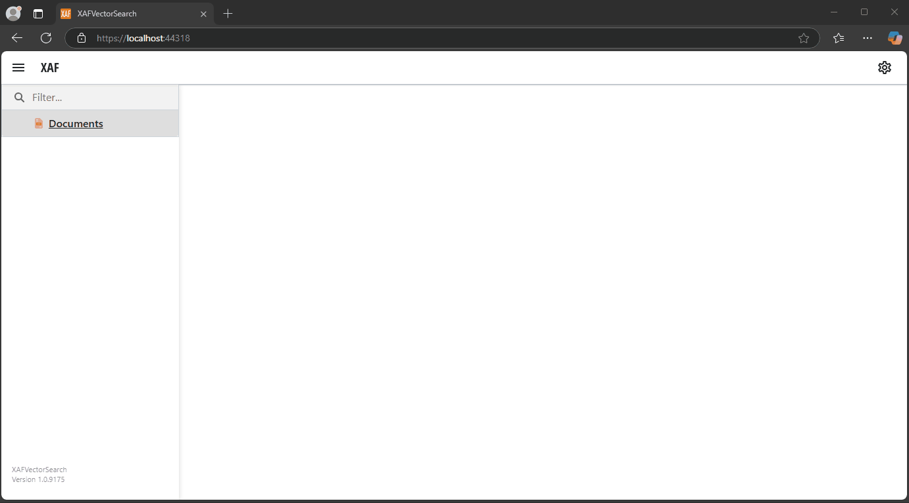

# XAF Blazor Vector Search

This simple PoC project XAF blazor uses native vector support from SQL Azure [Vector functions](https://learn.microsoft.com/en-us/sql/t-sql/functions/vector-functions-transact-sql?view=azuresqldb-current), [Native Vector Support in Azure SQL Database](https://devblogs.microsoft.com/azure-sql/exciting-announcement-public-preview-of-native-vector-support-in-azure-sql-database/) and [Vector Support in Azure SQL Database](https://devblogs.microsoft.com/azure-sql/announcing-eap-native-vector-support-in-azure-sql-database/)

Set the database connection in appsettings

```json
{
  "ConnectionStrings": {
	"DefaultConnection": "Server=.;Database=VectorSearch;Trusted_Connection=True;MultipleActiveResultSets=true"
  }
}
```	

In the AzureOpenAI section of the appsettings.json file, insert the access key for Microsoft's OpenAI service.

Once the document is loaded, click on **Embedding document** to generate the vector of the document (embedding model).

When chatting, a sorting operation will be performed based on the cosine similarity between the vectors of the document chunks in db and the vector of the entered phrase, and the top MaxRelevantChunks (in appsettings.json) will be taken to be used in the autocompletion context.
(autocomplete model)



